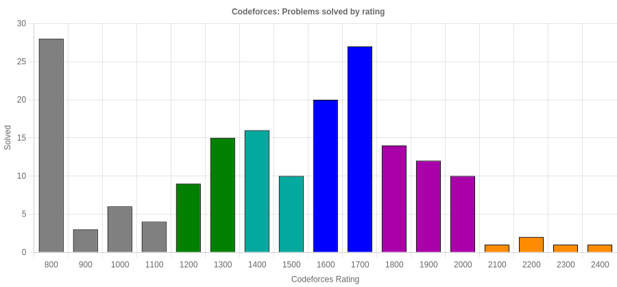

# README

## Introduction
A passionate software dev with a keen interest in problem solving and advanced algorithms. Loves learning new things.

## Contest Section

### Competitive Programming Profiles
| Platform   | Badge / Link |
|------------|--------------|
| Codeforces |  |
| CodeChef   |  |
| LeetCode   |  |
| AtCoder    |  |

#### Codeforces: Problems solved by rating

  

### Quick Stats
- **LeetCode total solved:** 114
- **AtCoder latest rating:** 691

---

## Dev: GitHub

